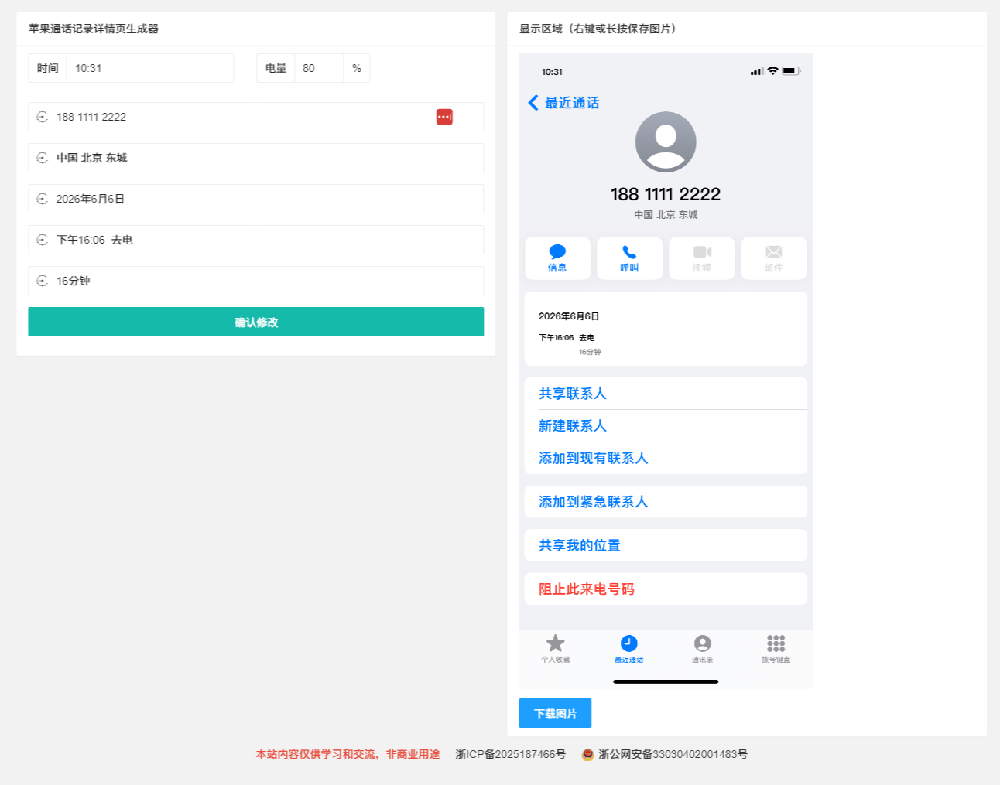

# 苹果通话记录详情页生成器

一个纯前端静态页面工具，用于在浏览器中生成苹果风格的通话记录详情图片。

## 技术栈

- HTML5
- CSS3
- 原生 JavaScript
- HTML5 Canvas（图片绘制）
- layui（UI 组件与时间选择器）

## 目录结构

```
Call_Log/
├── index.html          # 主页面
├── css/
│   └── style.css       # 自定义样式与字体声明
├── js/
│   └── main.js         # 表单处理与 Canvas 绘图逻辑
├── images/
│   └── iPhone Call log.png  # 通话记录底图模板
├── fonts/
│   ├── 苹方-简 中粗体.otf
│   └── 苹方-简 中黑体.otf
└── layui/              # layui 前端框架
    ├── layui.js
    ├── css/layui.css
    └── font/...
```

## 使用方法

1. 直接用浏览器打开 `index.html`（无需服务器）。
2. 在左侧表单中填写：时间、电量、电话、地区、日期、通话方式、通话时长。
3. 点击“确认修改”。
4. 右侧 Canvas 会实时渲染生成通话记录图片。
5. 可以右键/长按保存图片，或点击“下载图片”按钮保存为 PNG。

## 主要功能

- 前端 Canvas 绘制底图与文字
- 电量条按百分比动态显示（低于 21% 显示红色）
- 电话号码、地区文字自动居中
- 日期和时间自动填充当前默认值
- 支持自定义字体渲染
- 支持一键下载生成的图片

## 截图


